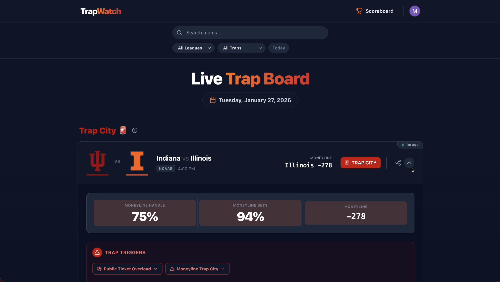

# TrapWatch

> A React + Firebase social sports-betting app that scrapes DraftKings betting splits into an updating Google Sheets using Google Functions, as well as live odds from The Odds API to detect **betting traps**, combined with real-time community voting and messaging.

TrapWatch flags **betting traps** — games where the betting line is moving one way while the public is piling onto the other side. That divergence between line movement and public money is what sportsbooks exploit, and TrapWatch surfaces it before kickoff.

It combines a few things into one product: an automated data pipeline that ingests **DraftKings public betting splits** (the % of money vs. the % of bets on each side) and **live odds from The Odds API**, a trap-detection engine that scores every game, and a social layer where users vote on which side is the trap and discuss games in real time. Under the hood it runs on **React 19** on the front end and **Firebase** (Firestore, Auth, and Cloud Functions) for real-time data and messaging, with a layer-based **FastAPI** backend driving ingestion and scoring.




### Features

- 📊 **Automated odds & splits ingestion** — pulls live spreads, moneylines, and totals from The Odds API and DraftKings public betting splits, per league.
- 🎯 **Trap detection engine** — compares live lines against opening lines and public money/bet percentages to score each game and classify its trap severity.
- 🗂️ **Trap feed** — games grouped into severity tiers, each card showing the exact market (moneyline / spread / total) and side that triggered the trap.
- 🗳️ **Community voting** — signed-in users vote on which side they think is the trap; Cloud Functions aggregate the tallies in real time.
- 💬 **Real-time discussion** — threaded comments per game, with live counts kept in sync via Firestore triggers.
- 🏈 **Multi-league coverage** — NFL, NCAAF, NBA, NCAAB, MLB, and NHL.
- 🔐 **Firebase Auth** — user accounts and personalized alerts.

Games are scored and bucketed into three tiers of trap severity:

| Label | Meaning |
|---|---|
| 🟡 **Trap Potential** | Early signs of a line/public divergence |
| 🟠 **Trap Detected** | Confirmed divergence, worth a second look |
| 🔴 **Trap City** | Strong divergence — the public is heavily on one side while the line says otherwise |

Covers NFL, NCAAF, NBA, NCAAB, MLB, and NHL.

## How it works

1. **Odds ingestion** — live odds (spread, moneyline, total) are pulled from [The Odds API](https://the-odds-api.com/) and opening lines are synced from a Google Sheet, per league.
2. **Trap detection** — a backend job compares current odds against opening lines and public betting/money percentages to compute a severity score, then classifies each game as Trap Potential / Detected / City.
3. **Feed** — the frontend renders scored games as cards, grouped by trap tier, with the specific market (moneyline/spread/total) and side that triggered the trap.
4. **Community layer** — signed-in users can vote on which side they think is the trap and discuss games in threaded comments; Firebase Cloud Functions aggregate votes and comment counts in real time.

## Tech stack

**Frontend** — React 19, TypeScript, Vite, Redux Toolkit, React Router, Firebase Auth/Firestore SDK.

**Backend** — Python, FastAPI, Google Cloud Firestore, deployed as a containerized API for odds ingestion, trap calculation, feed, votes, and comments.

**Cloud Functions** — Firebase Functions (Python) triggered on Firestore writes to aggregate votes and comment stats.

**Data sources** — [The Odds API](https://the-odds-api.com/) for live odds, Google Sheets for opening-line CSV imports.

## Project structure

```
trapwatch/
├── frontend/           React + Vite SPA
│   ├── components/     Game cards, filters, UI primitives
│   ├── pages/           Dashboard, Game Detail, Alerts, Scoreboard, Settings
│   ├── services/         API client, Firestore, storage helpers
│   ├── store/             Redux slices (auth, etc.)
│   └── utils/              API-to-domain-model mapping
├── backend/             FastAPI service
│   └── src/main/
│       ├── api/v1/routes/   events, odds, csv_odds, traps, feed, votes, comments
│       ├── service/          Business logic (trap detection, odds sync, etc.)
│       ├── repository/        Firestore data access
│       ├── dto/                 Request/response models
│       └── enums/                League, trap status, event status
├── functions/            Firebase Cloud Functions (vote/comment aggregation)
├── apps-script/          Google Apps Script scraping DK betting splits into the sheet
└── docs/                  Deployment notes
```

## Getting started

### Prerequisites

- Node.js 18+
- Python 3.13
- A Firebase project with Firestore enabled
- An [Odds API](https://the-odds-api.com/) key

### Frontend

```bash
cd frontend
npm install
npm run dev
```

### Backend

```bash
cd backend
python -m venv venv
source venv/bin/activate
pip install -r requirements.txt
```

Create `backend/.env` with:

```
GCP_PROJECT_ID=your-firebase-project-id
ODDS_API_KEY=your-odds-api-key
ODDS_API_BASE_URL=https://api.the-odds-api.com/v4
GOOGLE_SHEETS_BASE_URL=your-sheet-export-url
SCHEDULER_SECRET=optional-shared-secret
```

Run the API:

```bash
uvicorn main:app --reload --app-dir src/main
```

### Cloud Functions

See [docs/DEPLOYMENT.md](docs/DEPLOYMENT.md) for setup and deployment steps.